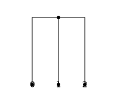
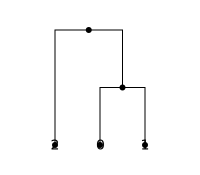
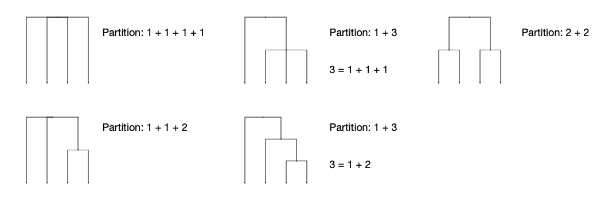

.. currentmodule:: tskit
.. _sec_combinatorics:

=============
Combinatorics
=============
tskit uses a combinatorial approach to identify unique topologies of
rooted, leaf-labelled trees. It provides methods
for enumerating all possible tree topologies, as well as converting
back and forth between a tree and its position, or rank, in the
enumeration of all possible topologies.
These methods do not only apply to binary trees;
rather, they cover general, rooted trees without unary nodes.

=================================     =====================================
:meth:`Tree.rank`                     Return the rank of this tree.
:meth:`Tree.unrank`                   Return a Tree given its rank and
                                      a number of leaves.
:func:`tskit.all_trees`               Return a generator over all
                                      leaf-labelled trees of n leaves.
:func:`tskit.all_tree_shapes`         Return a generator over all
                                      tree shapes of n leaves.
:func:`tskit.all_tree_labellings`     Return a generator over all
                                      labellings of the given tree's shape.
=================================     =====================================

.. _sec_tree_ranks:

+++++++++++++++++++++++
Interpreting Tree Ranks
+++++++++++++++++++++++
To understand tree ranks we must look at how leaf-labelled tree topologies
are enumerated. For example, we can use :func:`tskit.all_trees`
to generate all possible topologies of three leaves:

.. code-block:: python

    for t in tskit.all_trees(num_leaves=3):
        display(SVG(t.draw(node_labels={0: 0, 1: 1, 2: 2}, order="tree")))

In this sequence, there exist two distinct tree shapes and each shape
can be labelled in at least one unique way. Given that topologies are
ordered first by their shape and then by their labelling, a tree
topology can be uniquely identified by

1.
    The shape of the tree
2.
    The labelling of the tree's shape

We can refer to the first tree in the above enumeration as the
first labelling of the first shape of trees with three leaves, or tree
:math:`(0, 0)`. The second tree can be identified as the first labelling
of the second shape, or :math:`(1, 0)`, and so on.
This pair of indexes for the shape and labelling of a tree is referred
to as the rank of the tree, and can be computed using the
:meth:`Tree.rank` method.

.. code-block:: python

    ranks = [t.rank() for t in tskit.all_trees(num_leaves=3)]
    print("Ranks of 3-leaf trees:", ranks)

::

   Ranks of 3-leaf trees: [(0, 0), (1, 0), (1, 1), (1, 2)]

.. note::
    Ranks in combinatorics are typically natural numbers. However,
    we refer to this tuple of shape and label rank as a rank because
    it serves the same purpose of indexing trees in an enumeration.

For details on how shapes and labellings are ordered, see
:ref:`sec_enumerating_topologies`.

We can also reconstruct a leaf-labelled tree given its rank. This process
is known as unranking, and can be performed using the :meth:`Tree.unrank`
method.

.. code-block:: python

    for rank in [(0, 0), (1, 0), (1, 1), (1, 2)]:
        t = Tree.unrank(3, rank)
        display(SVG(t.draw(node_labels={0: 0, 1: 1, 2: 2}, order="tree")))

++++++++
Examples
++++++++

One application of tree ranks is to count the different
leaf-labelled topologies in a tree sequence. Since the ranks
are just tuples, we can use a Python ``Counter`` to track them.
Here, we count and unrank the most frequently seen
topology in a tree sequence. For brevity, this example assumes
samples are synonymous with leaves.

.. code-block:: python

    rank_counts = collections.Counter(t.rank() for t in ts.trees())
    most_freq_rank, count = rank_counts.most_common(1)[0]
    Tree.unrank(ts.num_samples(), most_freq_rank)

.. _sec_enumerating_topologies:

++++++++++++++++++++++
Enumerating Topologies
++++++++++++++++++++++

This section expands briefly on the approach used to enumerate
tree topologies that serves as the basis for :meth:`Tree.rank`
and :meth:`Tree.unrank`.
To enumerate all rooted, leaf-labelled tree topologies, we first
formulate a system of ordering and enumerating tree shapes. Then
we define an enumeration of labellings given an arbitrary tree shape.

***********************
Enumerating Tree Shapes
***********************

Starting with :math:`n = 1`, we see that the only shape for a tree
with a single leaf is a single root leaf. A tree with :math:`n > 1`
leaves can be obtained by joining at least two trees whose number of
leaves sum to :math:`n`.
This maps very closely to the concept of integer partitions.
Each tree shape of :math:`n` leaves can be represented by taking a
nondecreasing integer partition of :math:`n` (elements of the partition
are sorted in nondecreasing order) and recursively partitioning its
elements. The order in which we select partitions of :math:`n` is
determined by the efficient
`rule_asc <http://jeromekelleher.net/generating-integer-partitions.html>`_
algorithm for generating them.

All tree shapes with four leaves, and the partitions that generate
them, are:

Note that the middle column reflects all tree shapes of three leaves
in the right subtree!

`*` This excludes the partition [:math:`n`], since this would create a unary node
and trees with unary nodes are inumerable (and potentially infinite).

.. note::
    Using nondecreasing integer partitions enforces a
    *canonical orientation* on the tree shapes, where children under a node are
    ordered by the number of leaves below them.
    This is important because it prevents us from repeating trees that are
    topologically the same but whose children are ordered differently.

*********************
Labelling Tree Shapes
*********************

Tree shapes are useful in and of themselves, but we can use the enumeration
formulated above to go further and assign labels to the leaves of each shape.

Say we are given a tree :math:`T` with :math:`n` leaves, whose left-most
subtree, :math:`T_l`, has `k` leaves. For each of the :math:`n \choose k`
ways to select labels to assign to :math:`T_l`, we produce a unique labelling
of :math:`T`. This process of choosing labels is repeated for the other
children of :math:`T` and then recursively for the subtrees.

Looking back to the example from :ref:`sec_tree_ranks`, we can see
the different unique ways to label a particular tree of three leaves.

The order of the tree labellings is a direct result of the way in which
combinations of labels are chosen. The implementation in tskit uses a
standard lexicographic ordering to choose labels. See how the trees
are sorted by the order in which the left leaf's label was chosen.

.. note::
    There is a caveat here regarding symmetry, similar to that of repeating
    tree shapes. Symmetrical trees run the risk of creating redundant labellings
    if all combinations of labels were exhausted. To prevent redundant labellings
    we impose a *canonical labelling*. In the case of two symmetrical subtrees,
    the left subtree must receive the minimum label from the label set. Notice
    how this is the case in the right subtrees above.

These two enumerations create a complete ordering of topologies where trees are
ordered first by size (number of leaves), then by shape, then by their minimum
label. It is this canonical order that enables efficient ranking and unranking
of topologies.

