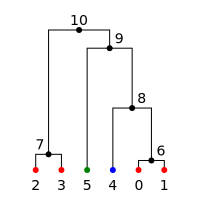
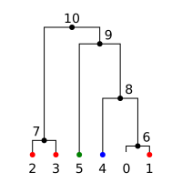
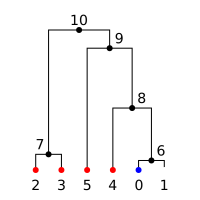
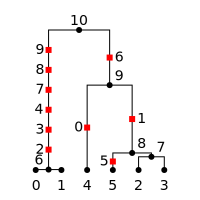
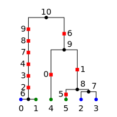

.. currentmodule:: tskit
.. _sec_tutorial:

========
Tutorial
========

.. todo:: The content here has been ported from the msprime tutorial and
    needs to be reorganised to make a coherent narrative.

.. _sec_tutorial_trees:

*****
Trees
*****

A :class:`Tree` represents a single tree in a :class:`TreeSequence`.
The ``tskit`` Tree implementation differs from most tree libraries by
using **integer IDs** to refer to nodes rather than objects. Thus, when we wish to
find the parent of the node with ID '0', we use ``tree.parent(0)``, which
returns another integer. If '0' does not have a parent in the current tree
(e.g., if it is a root), then the special value :data:`tskit.NULL`
(:math:`-1`) is returned. The children of a node are found using the
:meth:`Tree.children` method. To obtain information about a particular node,
one may either use ``tree.tree_sequence.node(u)`` to which returns the
corresponding :class:`Node` instance, or use the :meth:`Tree.time` or
:meth:`Tree.population` shorthands.

.. _sec_tutorial_trees_traversals:

++++++++++
Traversals
++++++++++

Tree traversals in various orders are possible using the :meth:`Tree.nodes` iterator.
For example, in the following tree we can visit the nodes in different orders:

.. code-block:: python

    for order in ["preorder", "inorder", "postorder"]:
        print(f"{order}:\t", list(tree.nodes(order=order)))

::

   preorder:        [7, 5, 0, 1, 2, 6, 3, 4]
   inorder:         [0, 5, 1, 2, 7, 3, 6, 4]
   postorder:       [0, 1, 2, 5, 3, 4, 6, 7]

Much of the time, the specific ordering of the nodes is not important
and we can leave it out (defaulting to preorder traversal). For example,
here we compute the total branch length of a tree::

    total_branch_length = sum(tree.branch_length(u) for u in tree.nodes())

This is also available as the :attr:`tskit.Tree.total_branch_length` attribute.

++++++++++++++++++
Traversing upwards
++++++++++++++++++

For many applications it is useful to be able to traverse upwards from the
leaves. We can do this using the :meth:`Tree.parent` method, which
returns the parent of a node. For example, we can traverse upwards from
each of the samples in the tree::

    for u in tree.samples():
        path = []
        v = u
        while v != tskit.NULL:
            path.append(v)
            v = tree.parent(v)
        print(u, "->", path)

giving::

   0 -> [0, 5, 7]
   1 -> [1, 5, 7]
   2 -> [2, 5, 7]
   3 -> [3, 6, 7]
   4 -> [4, 6, 7]

+++++++++++++++++++++++++++
Traversals with information
+++++++++++++++++++++++++++

Sometimes we will need to traverse down the tree while maintaining
some information about the nodes that are above it. While this
can be done using recursive algorithms, it is often more convenient
and efficient to use an iterative approach. Here, for example,
we define an iterator that yields all nodes in preorder along with
their path length to root::

    def preorder_dist(tree):
        for root in tree.roots:
            stack = [(root, 0)]
            while len(stack) > 0:
                u, distance = stack.pop()
                yield u, distance
                for v in tree.children(u):
                    stack.append((v, distance + 1))

    print(list(preorder_dist(tree)))

Running this on the example above gives us::

   [(7, 0), (6, 1), (4, 2), (3, 2), (5, 1), (2, 2), (1, 2), (0, 2)]

.. _sec_tutorial_networkx:

++++++++++++++++++++++++
Traversals with networkx
++++++++++++++++++++++++

Traversals and other network analysis can also be performed using the sizeable
`networkx <https://networkx.github.io/documentation/stable/index.html>`_
library. This can be achieved by calling :meth:`Tree.as_dict_of_dicts` to
convert a :class:`Tree` instance to a format that can be imported by networkx to
create a graph::

    import networkx as nx

    g = nx.DiGraph(tree.as_dict_of_dicts())
    print(sorted(g.edges))

::

    [(5, 0), (5, 1), (5, 2), (6, 3), (6, 4), (7, 5), (7, 6)]

++++++++++++++++++
Traversing upwards
++++++++++++++++++

We can revisit the above examples and traverse upwards with
networkx using a depth-first search algorithm::

    import networkx as nx

    g = nx.DiGraph(tree.as_dict_of_dicts())
    for u in tree.samples():
        path = [u] + [parent for parent, child, _ in
                      nx.edge_dfs(g, source=u, orientation="reverse")]
        print(u, "->", path)

giving::

   0 -> [0, 5, 7]
   1 -> [1, 5, 7]
   2 -> [2, 5, 7]
   3 -> [3, 6, 7]
   4 -> [4, 6, 7]

+++++++++++++++++++++++++++++++++
Calculating distances to the root
+++++++++++++++++++++++++++++++++

Similarly, we can yield the nodes of a tree along with their distance to the
root in pre-order in networkx as well::

    import networkx as nx

    g = nx.DiGraph(tree.as_dict_of_dicts())
    for root in tree.roots:
        print(nx.shortest_path_length(g, source=root).items())

Running this on the example above gives us the same result as before::

   [(7, 0), (6, 1), (4, 2), (3, 2), (5, 1), (2, 2), (1, 2), (0, 2)]

+++++++++++++++++++++++++++++++++++++++
Finding nearest neighbors
+++++++++++++++++++++++++++++++++++++++

If some samples in a tree are not at time 0, then finding the nearest neighbor
of a sample is a bit more involved. Instead of writing our own traversal code
we can again draw on a networkx algorithm.
Let us start with an example tree with three samples that were sampled at
different time points:

The generation times for these nodes are:

.. code-block:: python

    for u in tree.nodes():
        print(u, tree.time(u))

giving::

    4 20.005398778263334
    2 20.0
    3 17.833492457579652
    0 0.0
    1 1.0

Note that samples 0 and 1 are about 35 generations apart from each other even though
they were sampled at almost the same time. This is why samples 0 and 1 are
closer to sample 2 than to each other.

For this nearest neighbor search we will be traversing up and down the tree,
so it is easier to treat the tree as an undirected graph::

    g = nx.Graph(tree.as_dict_of_dicts())

When converting the tree to a networkx graph the edges are annotated with their
branch length::

    print(g.edges(data=True))

giving::

    [(4, 2, {'branch_length': 0.005398778263334236}),
     (4, 3, {'branch_length': 2.171906320683682}),
     (3, 0, {'branch_length': 17.833492457579652}),
     (3, 1, {'branch_length': 16.833492457579652})]

We can now use the "branch_length" field as a weight for a weighted shortest path
search::

    # a dictionary of dictionaries to represent our distance matrix
    dist_dod = collections.defaultdict(dict)
    for source, target in itertools.combinations(tree.samples(), 2):
        dist_dod[source][target] = nx.shortest_path_length(
            g, source=source, target=target, weight="branch_length"
        )
        dist_dod[target][source] = dist_dod[source][target]

    # extract the nearest neighbor of nodes 0, 1, and 2
    nearest_neighbor_of = [min(dist_dod[u], key=dist_dod[u].get) for u in range(3)]

    print(dict(zip(range(3), nearest_neighbor_of)))

gives::

    {0: 2, 1: 2, 2: 1}

.. _sec_tutorial_moving_along_a_tree_sequence:

****************************
Moving along a tree sequence
****************************

Most of the time we will want to iterate over all the trees in a tree sequence
sequentially as efficiently as possible. The simplest way to do this is to
use the :meth:`TreeSequence.trees` method:

.. code-block:: python

    import msprime

    ts = msprime.simulate(5, recombination_rate=1, random_seed=42)

    print("Tree sequence has {} trees".format(ts.num_trees))
    print()
    for tree in ts.trees():
        print(
            "Tree {} covers [{:.2f}, {:.2f}); TMRCA = {:.4f}".format(
                tree.index, *tree.interval, tree.time(tree.root)
            )
        )

Running the code, we get::

    Tree sequence has 7 trees

    Tree 0 covers [0.00, 0.08); TMRCA = 4.2542
    Tree 1 covers [0.08, 0.27); TMRCA = 2.5973
    Tree 2 covers [0.27, 0.37); TMRCA = 4.2542
    Tree 3 covers [0.37, 0.66); TMRCA = 2.5973
    Tree 4 covers [0.66, 0.71); TMRCA = 4.2542
    Tree 5 covers [0.71, 0.75); TMRCA = 2.5973
    Tree 6 covers [0.75, 1.00); TMRCA = 2.5973

Here we run a small simulation using `msprime <https://msprime.readthedocs.io>`_
which results in 7 distinct trees along a genome of length 1. We then iterate
over these trees sequentially using the :meth:`TreeSequence.trees` method,
and print out each tree's index, the interval over which the tree applies
and the time of the most recent common ancestor of all the samples. This
method is very efficient, and allows us to quickly iterate over very large
tree sequences.

We can also efficiently iterate over the trees backwards, using Python's
:func:`reversed` function:

.. code-block:: python

    for tree in reversed(ts.trees()):
        print(
            "Tree {} covers [{:.2f}, {:.2f}); TMRCA = {:.4f}".format(
                tree.index, *tree.interval, tree.time(tree.root)
            )
        )

giving::

    Tree 6 covers [0.75, 1.00); TMRCA = 2.5973
    Tree 5 covers [0.71, 0.75); TMRCA = 2.5973
    Tree 4 covers [0.66, 0.71); TMRCA = 4.2542
    Tree 3 covers [0.37, 0.66); TMRCA = 2.5973
    Tree 2 covers [0.27, 0.37); TMRCA = 4.2542
    Tree 1 covers [0.08, 0.27); TMRCA = 2.5973
    Tree 0 covers [0.00, 0.08); TMRCA = 4.2542

One of the reasons that the ``trees`` iterator allows us to access
the trees in a tree sequence so efficiently is because we use the
same underlying instance of the ``.Tree`` class each time. That is,
each time the iterator returns a value, it is actually the same tree
instance each time which has been updated internally to reflect the
(usually small) changes in the tree along the sequence. As a
result of this, if we store the results of the tree iterator in a
list, we will get unexpected results:

.. code-block:: python

    for tree in list(ts.trees()):
        print(
            "Tree {} covers [{:.2f}, {:.2f}): id={:x}".format(
                tree.index, *tree.interval, id(tree)
            )
        )

::

    Tree -1 covers [0.00, 0.00): id=7f290becb3c8
    Tree -1 covers [0.00, 0.00): id=7f290becb3c8
    Tree -1 covers [0.00, 0.00): id=7f290becb3c8
    Tree -1 covers [0.00, 0.00): id=7f290becb3c8
    Tree -1 covers [0.00, 0.00): id=7f290becb3c8
    Tree -1 covers [0.00, 0.00): id=7f290becb3c8
    Tree -1 covers [0.00, 0.00): id=7f290becb3c8

We have stored seven copies of the same :class:`Tree` instance in the
list. Because iteration has ended, this tree is in the "null" state (see
below for more details) which means that it doesn't represent any of the
trees in the tree sequence.

If we do wish to obtain a list of the trees, we can do so by using the
:meth:`TreeSequence.aslist` method:

.. code-block:: python

    for tree in ts.aslist():
        print(
            "Tree {} covers [{:.2f}, {:.2f}): id={:x}".format(
                tree.index, *tree.interval, id(tree)
            )
        )

::

    Tree 0 covers [0.00, 0.08): id=7fd2c50a40f0
    Tree 1 covers [0.08, 0.27): id=7fd2b2aca6d8
    Tree 2 covers [0.27, 0.37): id=7fd2b2adde10
    Tree 3 covers [0.37, 0.66): id=7fd2b2adddd8
    Tree 4 covers [0.66, 0.71): id=7fd2b2addd68
    Tree 5 covers [0.71, 0.75): id=7fd2b2addcf8
    Tree 6 covers [0.75, 1.00): id=7fd2b2addeb8

Note that we now have a different object for each tree in the list. Please
note that this is **much** less efficient than iterating over the trees
using the :meth:`TreeSequence.trees` method (and uses far more memory!),
and should only be used as a convenience when working with small trees.

We can also obtain specific trees along the sequence, using the
:meth:`TreeSequence.first`,
:meth:`TreeSequence.last`
:meth:`TreeSequence.at` and
:meth:`TreeSequence.at_index` methods. The ``first()`` and ``last()``
methods return the first and last trees in the sequence, as might be
imagined. The ``at()`` method returns the tree that covers a
given genomic location, and the ``at_index()`` method returns the
tree at a given index along the sequence:

.. code-block:: python

    tree = ts.at(0.5)
    print(
        "Tree {} covers [{:.2f}, {:.2f}): id={:x}".format(
            tree.index, *tree.interval, id(tree)
        )
    )
    tree = ts.at_index(0)
    print(
        "Tree {} covers [{:.2f}, {:.2f}): id={:x}".format(
            tree.index, *tree.interval, id(tree)
        )
    )
    tree = ts.at_index(-1)
    print(
        "Tree {} covers [{:.2f}, {:.2f}): id={:x}".format(
            tree.index, *tree.interval, id(tree)
        )
    )

::

    Tree 3 covers [0.37, 0.66): id=7f9fdb469630
    Tree 0 covers [0.00, 0.08): id=7f9fdb46d160
    Tree 6 covers [0.75, 1.00): id=7f9fdb469630

Note that each call to these methods returns a different :class:`Tree` instance
and so it is much, much less efficient to sequentially access trees
by their index values than it is to use the :meth:`TreeSequence.trees`
iterator.

**********************
Editing tree sequences
**********************

Sometimes we wish to make some minor modifications to a tree sequence that has
been generated by a simulation. However, tree sequence objects are **immutable**
and so we cannot edit them in place. To modify a tree sequence, we need to
extract the underlying :ref:`tables <sec_table_definitions>` of information, edit these tables,
and then create a new tree sequence from them.
These tables succinctly store everything we need to know
about a tree sequence, and can be manipulated using the :ref:`sec_tables_api`.
In the following example, we use this approach
to remove all singleton sites from a given tree sequence.

.. code-block:: python

    def strip_singletons(ts):
        tables = ts.dump_tables()
        tables.sites.clear()
        tables.mutations.clear()
        for tree in ts.trees():
            for site in tree.sites():
                assert len(site.mutations) == 1  # Only supports infinite sites muts.
                mut = site.mutations[0]
                if tree.num_samples(mut.node) > 1:
                    site_id = tables.sites.add_row(
                        position=site.position, ancestral_state=site.ancestral_state
                    )
                    tables.mutations.add_row(
                        site=site_id, node=mut.node, derived_state=mut.derived_state
                    )
        return tables.tree_sequence()

This function takes a tree sequence containing some infinite sites mutations as
input, and returns a copy in which all singleton sites have been removed.
The approach is very simple: we get a copy of the underlying
table data in a :class:`TableCollection` object, and first clear the
site and mutation tables. We then consider each site in turn,
and if the number of samples with
the mutation is greater than one, we add the site and mutation to our
output tables using :meth:`SiteTable.add_row` and :meth:`MutationTable.add_row`.
(In this case we consider only simple infinite sites mutations,
where we cannot have back or recurrent mutations. These would require a slightly
more involved approach where we keep a map of mutation IDs so that
mutation ``parent`` values could be computed. We have also omitted the
site and mutation metadata in the interest of simplicity.)

After considering each site, we then create a new tree sequence using
the :meth:`TableCollection.tree_sequence` method on our updated tables.
Using this function then, we get::

    >>> ts = msprime.simulate(10, mutation_rate=10)
    >>> ts.num_sites
    50
    >>> ts_new = strip_singletons(ts)
    >>> ts_new.num_sites
    44
    >>>

Thus, we have removed 6 singleton sites from the tree sequence.

.. todo::

    Add another example here where we use the array oriented API to edit
    the nodes and edges of a tree sequence. Perhaps decapitating would be a
    good example?

*******************
Working with Tables
*******************

Tables provide a convenient method for viewing, importing and exporting tree
sequences, and are closely tied to the underlying data structures.
There are eight tables that together define a tree sequence,
although some may be empty,
and together they form a :class:`TableCollection`.
The tables are defined in :ref:`Table Definitions <sec_table_definitions>`,
and the :ref:`Tables API <sec_tables_api>` section describes how to work with them.
Here we make some general remarks about what you can and cannot do with them.

``tskit`` provides direct access to the columns of each table as
``numpy`` arrays: for instance, if ``n`` is a ``NodeTable``, then ``n.time``
will return an array containing the birth times of the individuals whose genomes
are represented by the nodes in the table.
*However*, it is important to note that this is *not* a shallow copy:
modifying ``n.time`` will *not* change the node table ``n``.  This may change in
the future, but currently there are three ways to modify tables: ``.add_row()``,
``.set_columns()``, and ``.append_columns()``
(and also ``.clear()``, which empties the table).

For example, a node table could be constructed using ``.add_row()`` as
follows::

    n = tskit.NodeTable()
    sv = [True, True, True, False, False, False, False]
    tv = [0.0, 0.0, 0.0, 0.4, 0.5, 0.7, 1.0]
    pv = [0, 0, 0, 0, 0, 0, 0]
    for s, t, p in zip(sv, tv, pv):
        n.add_row(flags=s, population=p, time=t)

obtaining::

    >>> print(n)
    id    flags    population    individual    time    metadata
    0    1    0    -1    0.0
    1    1    0    -1    0.0
    2    1    0    -1    0.0
    3    0    0    -1    0.4
    4    0    0    -1    0.5
    5    0    0    -1    0.7
    6    0    0    -1    1.0

The ``.add_row()`` method is natural (and should be reasonably efficient) if
new records appear one-by-one. In the example above it would have been more
natural to use ``.set_columns()`` --- equivalently::

    n = tskit.NodeTable()
    n.set_columns(flags=sv, population=pv, time=tv)

Since columns cannot be modified directly as properties of the tables,
they must be extracted, modified, then replaced.
For example, here we add 1.4 to every ``time`` except the first
in the node table constructed above (using ``numpy`` indexing)::

    tn = n.time
    tn[1:] = tn[1:] + 1.4
    n.set_columns(flags=n.flags, population=n.population, time=tn)

The result is::

    >>> print(n)
    id    flags    population    individual    time    metadata
    0    1    0    -1    0.0
    1    1    0    -1    1.4
    2    1    0    -1    1.4
    3    0    0    -1    1.8
    4    0    0    -1    1.9
    5    0    0    -1    2.1
    6    0    0    -1    2.4

*****************************
Overview of the Tables Format
*****************************

The :ref:`Table Definitions <sec_table_definitions>` section gives a precise
definition of how a tree sequence is stored in a collection of tables.
Here we give an overview. Consider the following sequence of trees::

    time ago
    --------
       1.0         6
                 ┏━┻━━┓
                 ┃    ┃
       0.7       ┃    ╋                     5
                 ┃    ┃                   ┏━┻━┓
       0.5       ┃    4         4         ┃   4
                 ┃  ┏━┻━┓     ┏━┻━┓       ┃ ┏━┻━┓
                 ┃  ┃   ┃     ┃   ╋       ┃ ┃   ┃
       0.4       ┃  ┃   ┃     ┃   3       ┃ ┃   ┃
                 ┃  ┃   ┃     ┃ ┏━┻━┓     ┃ ┃   ┃
                 ┃  ┃   ┃     ┃ ┃   ╋     ┃ ┃   ┃
       0.0       0  1   2     1 0   2     0 1   2

    position 0.0          0.2         0.8         1.0

Ancestral recombination events have produced three different trees
that relate the three sampled genomes ``0``, ``1``, and ``2`` to each other
along the chromosome of length 1.0.

Each node in each of the above trees represents a particular ancestral genome
(a *haploid* genome; diploid individuals would be represented by two nodes).
We record when each of nodes lived in a :class:`NodeTable`::

    NodeTable:

    id      flags    population   time
    0       1        0            0
    1       1        0            0
    2       1        0            0
    3       0        0            0.4
    4       0        0            0.5
    5       0        0            0.7
    6       0        0            1.0

Importantly, the first column, ``id``, is not actually recorded, and is
only shown when printing out node tables (as here) for convenience.
The second column, ``flags`` records a ``1`` for the individuals that are *samples*,
i.e., whose entire genealogical history is recorded by these trees.
(Note that the trees above record that node 3 inherited from node 4
on the middle portion of the genome, but not on the ends.)

We next need to record each tree's edges. Since some edges are present
in more than one tree (e.g., node 1 inherits from node 4 across
the entire sequence), we record in the :class:`EdgeTable` each edge
and the genomic region for which it appears in the trees::

    EdgeTable:

    left    right   parent  children
    0.2     0.8     3       0
    0.2     0.8     3       2
    0.0     1.0     4       1
    0.0     0.2     4       2
    0.8     1.0     4       2
    0.2     0.8     4       3
    0.8     1.0     5       0
    0.8     1.0     5       4
    0.0     0.2     6       0
    0.0     0.2     6       4

Since node 3 is most recent, the edge that says that nodes 0 and 2 inherit
from node 3 on the interval between 0.2 and 0.8 comes first.  Next are the
edges from node 4: there are four of these, as the edge from node 4 to node
1 is shared across the entire sequence, and for each of the three
genomic intervals there is an additional child node. At this
point, we know the full tree on the middle interval.  Finally, edges
specifying the common ancestor of 0 and 4 on the remaining intervals (parents 6
and 5 respectively) allow us to construct all trees across the entire interval.

There are three mutations in the depiction above,
marked by ``╋``: one above node ``4`` on the first tree,
and the other two above nodes ``2`` and ``3`` on the second tree.
Suppose that the first mutation occurs at position 0.1 and the mutations in the
second tree both occurred at the same position, at 0.5 (with a back mutation).
To record the inheritance patterns of these, we need only record
the positions on the genome at which they occurred,
and on which edge (equivalently, above which node) they occurred.
The positions are recorded in the :class:`SiteTable`::

    SiteTable:

    id    position    ancestral_state
    0    0.1         0
    1    0.5         0

As with node tables, the ``id`` column is **not** actually recorded, but is
implied by the position in the table.  The results of the
actual mutations are then recorded::

    MutationTable:

    site    node    derived_state
    0        4        1
    1        3        1
    1        2        0

This would then result in the following (two-locus) haplotypes for the three
samples::

    sample  haplotype
    ------  ---------
    0       01
    1       10
    2       10

To create these tables, and the corresponding tree sequence, we would
create a :class:`TableCollection`, and then use its
:meth:`TableCollection.tree_sequence` method::

    tables = tskit.TableCollection(sequence_length=1.0)

    # Nodes
    sv = [True, True, True, False, False, False, False]
    tv = [0.0, 0.0, 0.0, 0.4, 0.5, 0.7, 1.0]

    for is_sample, t in zip(sv, tv):
     flags = tskit.NODE_IS_SAMPLE if is_sample else 0
     tables.nodes.add_row(flags=flags, time=t)

    # Edges
    lv = [0.2, 0.2, 0.0, 0.0, 0.8, 0.2, 0.8, 0.8, 0.0, 0.0]
    rv = [0.8, 0.8, 1.0, 0.2, 1.0, 0.8, 1.0, 1.0, 0.2, 0.2]
    pv = [3, 3, 4, 4, 4, 4, 5, 5, 6, 6]
    cv = [0, 2, 1, 2, 2, 3, 0, 4, 0, 4]

    for l, r, p, c in zip(lv, rv, pv, cv):
        tables.edges.add_row(left=l, right=r, parent=p, child=c)

    # Sites
    for p, a in zip([0.1, 0.5], ['0', '0']):
        tables.sites.add_row(position=p, ancestral_state=a)

    # Mutations
    for s, n, d in zip([0, 1, 1], [4, 3, 2], ['1', '1', '0']):
        tables.mutations.add_row(site=s, node=n, derived_state=d)

We can then finally obtain the tree sequence::

    ts = tables.tree_sequence()
    for t in ts.trees():
      print(t.draw(format='unicode'))

::

      6
    ┏━┻┓
    ┃  4
    ┃ ┏┻┓
    0 1 2

      4
    ┏━┻┓
    ┃  3
    ┃ ┏┻┓
    1 0 2

      5
    ┏━┻┓
    ┃  4
    ┃ ┏┻┓
    0 1 2

.. _sec_tutorial_metadata:

*********************
Working with Metadata
*********************

Metadata is information associated with entities that tskit doesn't use or interpret,
but which is useful to pass on to downstream analysis such as sample ids, dates etc. See
:ref:`sec_metadata` for a full discussion. Each table has a
:class:`tskit.MetadataSchema` accessed as ``table.metadata_schema``. which details the
contents and encoding of the metadata for each row. A metadata schema is a JSON document
that conforms to `JSON Schema <https://json-schema.org/understanding-json-schema/>`_
(The full schema for tskit is at :ref:`sec_metadata_schema_schema`).

++++++++++++++++++++++++++++
Reading metadata and schemas
++++++++++++++++++++++++++++

Metadata is automatically decoded using the schema when accessed via a
:class:`TreeSequence` or :class:`TableCollection` Python API. For example:

.. code-block:: python

    >>> ts.individual(0).metadata
    {'accession': 'ERS0001', 'pcr': True}
    >>> ts.tables.individuals[0].metadata
    {'accession': 'ERS0001', 'pcr': True}

Viewing the :class:`tskit.MetadataSchema` for a table can help with understanding
its metadata as it can contain descriptions and constraints:

.. code-block:: python

    >>> pprint.pprint(ts.table_metadata_schemas.individual)
    {'additionalProperties': False,
     'codec': 'json',
     'properties': {'accession': {'description': 'ENA accession number',
                                  'type': 'string'},
                    'pcr': {'description': 'Was PCR used on this sample',
                            'name': 'PCR Used',
                            'type': 'boolean'}},
     'required': ['accession', 'pcr'],
     'type': 'object'}

    >>> pprint.pprint(ts.tables.individuals.metadata_schema)
    (.... as above)

The top-level metadata and schemas for the entire tree sequence is similarly
accessed with ``ts.metadata`` and ``ts.metadata_schema``.

If there is no schema (i.e. it is equal to ``MetadataSchema(None)``) for a table
or top-level metadata, then no decoding is performed and ``bytes`` will be returned.

++++++++++++++++++++++++++++++
Modifying metadata and schemas
++++++++++++++++++++++++++++++

If you are creating or modifying a tree sequence you may want to record or add to the
metadata. When doing so the schema must be modified first, as it is then used to
validate and encode the metadata.

Schemas in tskit are held in a :class:`tskit.MetadataSchema`.
A Python dict representation of the schema is passed to its constructor, which
will validate the schema:

.. code-block:: python

    schema = tskit.MetadataSchema({"codec": "json" ...... })

This :class:`tskit.MetadataSchema` can then be assigned to a table or the top-level
tree sequence e.g.
:attr:`metadata_schema <tskit.IndividualTable.metadata_schema>`:

.. code-block:: python

    tables = tskit.TableCollection(sequence_length=1)
    tables.individuals.metadata_schema = schema

This will overwrite any existing schema. Note that this will not validate any existing
metadata against the new schema. Now that the table has a schema calls to
:meth:`add_row <tskit.IndividualTable.add_row>` will validate and encode the metadata:

.. code-block:: python

    tables.individuals.add_row(0, metadata={"accession": "Bob1234", "pcr": True})

and if we try to add metadata that doesn't fit the schema, such as accidentally using a
string instead of a proper Python boolean, we'll get an error:

.. code-block:: python

    tables.individuals.add_row(0, metadata={"accession": "Bob1234", "pcr": "false"})

::

    Traceback (most recent call last):
      File "/home/benj/projects/tskit/python/tskit/metadata.py", line 181, in validate_and_encode_row
        self._validate_row(row)
      File "/home/benj/projects/tskit/env/lib/python3.8/site-packages/jsonschema/validators.py", line 353, in validate
        raise error
    jsonschema.exceptions.ValidationError: 'false' is not of type 'boolean'

    Failed validating 'type' in schema['properties']['pcr']:
        {'description': 'Was PCR used on this sample',
         'name': 'PCR Used',
         'type': 'boolean'}

    On instance['pcr']:
        'false'

    The above exception was the direct cause of the following exception:

    Traceback (most recent call last):
      File "<stdin>", line 1, in <module>
      File "/home/benj/projects/tskit/python/tskit/tables.py", line 409, in add_row
        metadata = self.metadata_schema.validate_and_encode_row(metadata)
      File "/home/benj/projects/tskit/python/tskit/metadata.py", line 183, in validate_and_encode_row
        raise exceptions.MetadataValidationError from ve
    tskit.exceptions.MetadataValidationError

To set the top-level metadata, just assign it. Validation and encoding happen as specified by the
top-level metadata schema (Note that provenance info should go in :ref:`sec_provenance`
not metadata):

.. code-block:: python

    tables.metadata = {"mean_coverage": 200.5}

To modify a schema, for example to add a key; first get the dict representation, modify
then write back:

.. code-block:: python

    schema_dict = tables.individuals.metadata_schema.schema
    schema_dict["properties"]["newKey"] = {"type": "integer"}
    tables.individuals.metadata_schema = tskit.MetadataSchema(schema_dict)

To modify the metadata of rows in tables use the :ref:`sec_tutorial_metadata_bulk`.

++++++++++++++++++++
Viewing raw metadata
++++++++++++++++++++

If you need to see the raw (i.e., bytes) metadata, you just need to remove the
schema, for instance:

..  code-block:: python

    tables.individuals.add_row(metadata={'accession': 'abc123', 'newKey':25}})
    tables.individuals[0].metadata
    # {'accession': 'abc123', 'newKey': '25'}
    tables.individuals.MetadataSchema = tskit.MetadataSchema(None)
    tables.individuals[0].metadata
    # b'abc123\x00\x00\x19'

.. _sec_tutorial_metadata_bulk:

+++++++++++++++++++++++++++++++
Metadata for bulk table methods
+++++++++++++++++++++++++++++++

In the interests of efficiency each table's
:meth:`packset_metadata <tskit.NodeTable.packset_metadata>` method, as well as the more
general :meth:`set_columns <tskit.NodeTable.set_columns>` and
:meth:`append_columns <tskit.NodeTable.append_columns>` do not attempt to validate or
encode metadata. You can call
:meth:`MetadataSchema.validate_and_encode_row <tskit.MetadataSchema.validate_and_encode_row>`
directly to prepare metadata for these methods:

.. code-block:: python

    metadata_column = [
        {"accession": "etho1234", "pcr": True},
        {"accession": "richard1235", "pcr": False},
        {"accession": "albert1236", "pcr": True},
    ]
    encoded_metadata_column = [
        table.metadata_schema.validate_and_encode_row(r) for r in metadata_column
    ]
    metadata, metadata_offset = tskit.pack_bytes(encoded_metadata_column)
    table.set_columns(flags=[0, 0, 0], metadata=metadata, metadata_offset=metadata_offset)

Or if all columns do not need to be set:

.. code-block:: python

    table.packset_metadata(
        [table.metadata_schema.validate_and_encode_row(r) for r in metadata_column]
    )

.. _sec_tutorial_metadata_binary:

+++++++++++++++
Binary metadata
+++++++++++++++

To disable the validation and encoding of metadata and store raw bytes pass ``None`` to
:class:`tskit.MetadataSchema`

.. code-block:: python

    table.metadata_schema = tskit.MetadataSchema(None)
    table.add_row(0, metadata=b"SOME CUSTOM BYTES #!@")
    t[0].metadata

::

    b'SOME CUSTOM BYTES #!@'

**************
Calculating LD
**************

The ``tskit`` API provides methods to efficiently calculate
population genetics statistics. For example, the :class:`LdCalculator`
class allows us to compute pairwise `linkage disequilibrium
<https://en.wikipedia.org/wiki/Linkage_disequilibrium>`_ coefficients.
Here we use the :meth:`LdCalculator.r2_matrix` method to easily make an
LD plot using `matplotlib <http://matplotlib.org/>`_. (Thanks to
the excellent `scikit-allel
<http://scikit-allel.readthedocs.io/en/latest/index.html>`_
for the basic `plotting code
<http://scikit-allel.readthedocs.io/en/latest/_modules/allel/stats/ld.html#plot_pairwise_ld>`_
used here.)

.. code-block:: python

    import msprime
    import tskit
    import matplotlib.pyplot as pyplot

    def ld_matrix_example():
        ts = msprime.simulate(100, recombination_rate=10, mutation_rate=20, random_seed=1)
        ld_calc = tskit.LdCalculator(ts)
        A = ld_calc.r2_matrix()
        # Now plot this matrix.
        x = A.shape[0] / pyplot.rcParams["figure.dpi"]
        x = max(x, pyplot.rcParams["figure.figsize"][0])
        fig, ax = pyplot.subplots(figsize=(x, x))
        fig.tight_layout(pad=0)
        im = ax.imshow(A, interpolation="none", vmin=0, vmax=1, cmap="Blues")
        ax.set_xticks([])
        ax.set_yticks([])
        for s in "top", "bottom", "left", "right":
            ax.spines[s].set_visible(False)
        pyplot.gcf().colorbar(im, shrink=0.5, pad=0)
        pyplot.savefig("ld.svg")

.. image:: _static/ld.svg
   :width: 800px
   :alt: An example LD matrix plot.

.. _sec_tutorial_threads:

********************
Working with threads
********************

When performing large calculations it's often useful to split the
work over multiple processes or threads. The ``tskit`` API can
be used without issues across multiple processes, and the Python
:mod:`multiprocessing` module often provides a very effective way to
work with many replicate simulations in parallel.

When we wish to work with a single very large dataset, however, threads can
offer better resource usage because of the shared memory space. The Python
:mod:`threading` library gives a very simple interface to lightweight CPU
threads and allows us to perform several CPU intensive tasks in parallel. The
``tskit`` API is designed to allow multiple threads to work in parallel when
CPU intensive tasks are being undertaken.

.. note:: In the CPython implementation the `Global Interpreter Lock
   <https://wiki.python.org/moin/GlobalInterpreterLock>`_ ensures that
   only one thread executes Python bytecode at one time. This means that
   Python code does not parallelise well across threads, but avoids a large
   number of nasty pitfalls associated with multiple threads updating
   data structures in parallel. Native C extensions like ``numpy`` and ``tskit``
   release the GIL while expensive tasks are being performed, therefore
   allowing these calculations to proceed in parallel.

In the following example we wish to find all mutations that are in approximate
LD (:math:`r^2 \geq 0.5`) with a given set of mutations. We parallelise this
by splitting the input array between a number of threads, and use the
:meth:`LdCalculator.r2_array` method to compute the :math:`r^2` value
both up and downstream of each focal mutation, filter out those that
exceed our threshold, and store the results in a dictionary. We also
use the very cool `tqdm <https://pypi.python.org/pypi/tqdm>`_ module to give us a
progress bar on this computation.

.. code-block:: python

    import threading
    import numpy as np
    import tqdm
    import msprime
    import tskit

    def find_ld_sites(
        tree_sequence, focal_mutations, max_distance=1e6, r2_threshold=0.5, num_threads=8
    ):
        results = {}
        progress_bar = tqdm.tqdm(total=len(focal_mutations))
        num_threads = min(num_threads, len(focal_mutations))

        def thread_worker(thread_index):
            ld_calc = tskit.LdCalculator(tree_sequence)
            chunk_size = int(math.ceil(len(focal_mutations) / num_threads))
            start = thread_index * chunk_size
            for focal_mutation in focal_mutations[start : start + chunk_size]:
                a = ld_calc.r2_array(
                    focal_mutation, max_distance=max_distance, direction=tskit.REVERSE
                )
                rev_indexes = focal_mutation - np.nonzero(a >= r2_threshold)[0] - 1
                a = ld_calc.r2_array(
                    focal_mutation, max_distance=max_distance, direction=tskit.FORWARD
                )
                fwd_indexes = focal_mutation + np.nonzero(a >= r2_threshold)[0] + 1
                indexes = np.concatenate((rev_indexes[::-1], fwd_indexes))
                results[focal_mutation] = indexes
                progress_bar.update()

        threads = [
            threading.Thread(target=thread_worker, args=(j,)) for j in range(num_threads)
        ]
        for t in threads:
            t.start()
        for t in threads:
            t.join()
        progress_bar.close()
        return results

    def threads_example():
        ts = msprime.simulate(
            sample_size=1000,
            Ne=1e4,
            length=1e7,
            recombination_rate=2e-8,
            mutation_rate=2e-8,
        )
        counts = np.zeros(ts.num_sites)
        for tree in ts.trees():
            for site in tree.sites():
                assert len(site.mutations) == 1
                mutation = site.mutations[0]
                counts[site.id] = tree.num_samples(mutation.node)
        doubletons = np.nonzero(counts == 2)[0]
        results = find_ld_sites(ts, doubletons, num_threads=8)
        print("Found LD sites for", len(results), "doubleton sites out of", ts.num_sites)

In this example, we first simulate 1000 samples of 10 megabases and find all
doubleton mutations in the resulting tree sequence. We then call the
``find_ld_sites()`` function to find all mutations that are within 1 megabase
of these doubletons and have an :math:`r^2` statistic of greater than 0.5.

The ``find_ld_sites()`` function performs these calculations in parallel using
8 threads. The real work is done in the nested ``thread_worker()`` function,
which is called once by each thread. In the thread worker, we first allocate an
instance of the :class:`LdCalculator` class. (It is **critically important**
that each thread has its own instance of :class:`LdCalculator`, as the threads
will not work efficiently otherwise.) After this, each thread works out the
slice of the input array that it is responsible for, and then iterates over
each focal mutation in turn. After the :math:`r^2` values have been calculated,
we then find the indexes of the mutations corresponding to values greater than
0.5 using :func:`numpy.nonzero`. Finally, the thread stores the resulting array
of mutation indexes in the ``results`` dictionary, and moves on to the next
focal mutation.

Running this example we get::

    >>> threads_example()
    100%|████████████████████████████████████████████████| 4045/4045 [00:09<00:00, 440.29it/s]
    Found LD sites for 4045 doubleton mutations out of 60100

.. _sec_tutorial_parsimony:

*********
Parsimony
*********

The :meth:`Tree.map_mutations` method finds a parsimonious explanation for a
set of discrete character observations on the samples in a tree using classical phylogenetic
algorithms.

.. code-block:: python

    tree = msprime.simulate(6, random_seed=42).first()
    alleles = ["red", "blue", "green"]
    genotypes = [0, 0, 0, 0, 1, 2]
    node_colours = {j: alleles[g] for j, g in enumerate(genotypes)}
    ancestral_state, mutations = tree.map_mutations(genotypes, alleles)
    print("Ancestral state = ", ancestral_state)
    for mut in mutations:
        print(f"Mutation: node = {mut.node} derived_state = {mut.derived_state}")
    tree.draw("_static/parsimony1.svg", node_colours=node_colours)

We get::

    Ancestral state =  red
    Mutation: node = 5 derived_state = green
    Mutation: node = 4 derived_state = blue

So, the algorithm has concluded, quite reasonably, that the most parsimonious
description of this state is that the ancestral state is red and there was
a mutation to blue and green over nodes 4 and 5.

+++++++++++++++
Building tables
+++++++++++++++

One of the main uses of :meth:`Tree.map_mutations` is to position mutations on a tree
to encode observed data. In the following example we show how a set
of tables can be updated using the :ref:`Tables API<sec_tables_api>`; here we
infer the location of mutations in an simulated tree sequence, and recompute
the node and edge tables exactly::

    ts = msprime.simulate(6, random_seed=23)
    ts = msprime.mutate(
        ts, rate=3, model=msprime.InfiniteSites(msprime.NUCLEOTIDES), random_seed=2)

    tree = ts.first()
    tables = ts.dump_tables()
    # Reinfer the sites and mutations from the variants.
    tables.sites.clear()
    tables.mutations.clear()
    for var in ts.variants():
        ancestral_state, mutations = tree.map_mutations(var.genotypes, var.alleles)
        tables.sites.add_row(var.site.position, ancestral_state=ancestral_state)
        parent_offset = len(tables.mutations)
        for mutation in mutations:
            parent = mutation.parent
            if parent != tskit.NULL:
                parent += parent_offset
            tables.mutations.add_row(
                var.index, node=mutation.node, parent=parent,
                derived_state=mutation.derived_state)

    assert tables.sites == ts.tables.sites
    assert tables.mutations == ts.tables.mutations
    print(tables.sites)
    print(tables.mutations)

The output is::

    id      position        ancestral_state metadata
    0       0.25849808      T
    1       0.26682728      G
    2       0.32053644      C
    3       0.40730783      T
    4       0.49856117      G
    5       0.58679698      A
    6       0.61927097      A
    7       0.71975423      T
    8       0.94773061      C
    id      site    node    derived_state   parent  metadata
    0       0       8       C       -1
    1       1       7       C       -1
    2       2       4       A       -1
    3       3       9       C       -1
    4       4       8       A       -1
    5       5       8       T       -1
    6       6       5       G       -1
    7       7       8       A       -1
    8       8       3       T       -1

++++++++++++
Missing data
++++++++++++

The Fitch parsimony algorithm in :meth:`Tree.map_mutations` can also take missing data
into account when finding a set of parsimonious state transitions. We do this by
specifying the special value ``-1`` as the state, which is treated by the algorithm as
"could be anything".

For example, here we state that sample 0 is missing, and use the colour white to indicate
this::

    tree = msprime.simulate(6, random_seed=42).first()
    alleles = ["red", "blue", "green", "white"]
    genotypes = [-1, 0, 0, 0, 1, 2]
    node_colours = {j: alleles[g] for j, g in enumerate(genotypes)}
    ancestral_state, mutations = tree.map_mutations(genotypes, alleles)
    print("Ancestral state = ", ancestral_state)
    for mut in mutations:
        print(f"Mutation: node = {mut.node} derived_state = {mut.derived_state}")
    tree.draw("_static/parsimony2.svg", node_colours=node_colours)

As before, we get::

    Ancestral state =  red
    Mutation: node = 5 derived_state = green
    Mutation: node = 4 derived_state = blue

The algorithm decided, again, quite reasonably, that the most parsimonious explanation
for the input data is the same as before. Thus, if we used this information to fill
out mutation table as above, we would impute the missing value for 0 as red.

The output of the algorithm can be a little surprising at times. Consider this example::

    tree = msprime.simulate(6, random_seed=42).first()
    alleles = ["red", "blue", "white"]
    genotypes = [1, -1, 0, 0, 0, 0]
    node_colours = {j: alleles[g] for j, g in enumerate(genotypes)}
    ancestral_state, mutations = tree.map_mutations(genotypes, alleles)
    print("Ancestral state = ", ancestral_state)
    for mut in mutations:
        print(f"Mutation: node = {mut.node} derived_state = {mut.derived_state}")
    tree.draw("_static/parsimony3.svg", node_colours=node_colours)

The output we get is::

    Ancestral state =  red
    Mutation: node = 6 derived_state = blue

Note that this is putting a mutation to blue over node 6, **not** node 0 as
we might expect. Thus, we impute here that node 1 is blue. It is important
to remember that the algorithm is minimising the number of state transitions;
this may not correspond always to what we might consider the most parsimonious
explanation.

.. _sec_tutorial_stats:

********************
Computing statistics
********************

Tskit provides an extensive and flexible interface for computing population
genetic statistics, which is documented in detail in the :ref:`general statistics
<sec_stats>` section. This tutorial aims to give a quick overview of
how the APIs work how to use them effectively.

First, lets simulate a tree sequence to work with which has roughly human
parameters for 10 thousand samples and 10Mb chromosomes::

    ts = msprime.simulate(
        10**4, Ne=10**4, recombination_rate=1e-8, mutation_rate=1e-8, length=10**7,
        random_seed=42)

We end up with 36K trees 39K segregating sites. We'd now like to compute some statistics on
this dataset.

++++++++++++++++++
One-way statistics
++++++++++++++++++

We refer to statistics that are defined with respect to a single set of
samples as "one-way". An example of such a statistic is diversity, which
is computed using the :meth:`TreeSequence.diversity` method::

    x = ts.diversity()
    print("Average diversity per unit sequence length = {:.3G}".format(x))

    [Output]

    Average diversity per unit sequence length = 0.000401

This tells the average diversity across the whole sequence and returns a single
number. We'll usually want to compute statistics in
:ref:`windows <sec_stats_windows>` along the genome and we
use the ``windows`` argument to do this::

    windows = np.linspace(0, ts.sequence_length, num=5)
    x = ts.diversity(windows=windows)
    print(windows)
    print(x)

    [Output]

    [       0.  2500000.  5000000.  7500000. 10000000.]
    [0.00041602 0.00039112 0.00041554 0.00038329]

The ``windows`` argument takes a numpy array specifying the breakpoints
along the genome. Here, we use numpy to create four equally spaced windows
of size 2.5 megabases (the windows array contains k + 1 elements to define
k windows). Because we have asked for values in windows, tskit now returns
a numpy array rather than a single value. (See
:ref:`sec_stats_output_dimensions` for a full description of how the output
dimensions of statistics are determined by the ``windows`` argument.)

Suppose we wanted to compute diversity within a specific subset of samples.
We can do this using the ``sample_sets`` argument::

    A = ts.samples()[:100]
    x = ts.diversity(sample_sets=A)
    print(x)

    [Output]

    0.00040166573737371227

Here, we've computed the average diversity within the first hundred samples across
the whole genome. As we've not specified any windows, this is again a single value.

We can also compute diversity in *multiple* sample sets at the same time by providing
a list of sample sets as an argument::

    A = ts.samples()[:100]
    B = ts.samples()[100:200]
    C = ts.samples()[200:300]
    x = ts.diversity(sample_sets=[A, B, C])
    print(x)

    [Output]

    [0.00040167 0.00040008 0.00040103]

Because we've computed multiple statistics concurrently, tskit returns a numpy array
of these statistics. We have asked for diversity within three different sample sets,
and tskit therefore returns an array with three values. (In general, the
dimensions of the input determines the dimensions of the output: see
:ref:`sec_stats_output_dimensions` for a detailed description of the rules.)

We can also compute multiple statistics in multiple windows::

    x = ts.diversity(sample_sets=[A, B, C], windows=windows)
    print("shape = ", x.shape)
    print(x)

    [Output]

    shape =  (4, 3)
    [[0.0004139  0.00041567 0.00041774]
     [0.00039148 0.00039152 0.00038997]
     [0.00042019 0.00041039 0.00041475]
     [0.0003811  0.00038274 0.00038166]]

We have computed diversity within three different sample sets across four
genomic windows, and our output is therefore a 2D numpy array with four
rows and three columns: each row contains the diversity values within
A, B and C for a particular window.

++++++++++++++++++++
Multi-way statistics
++++++++++++++++++++

Many population genetic statistics compare multiple sets of samples to
each other. For example, the :meth:`TreeSequence.divergence` method computes
the divergence between two subsets of samples::

    A = ts.samples()[:100]
    B = ts.samples()[:100]
    x = ts.divergence([A, B])
    print(x)

    [Output]

    0.00039764908000000676

The divergence between two sets of samples A and B is a single number,
and we we again return a single floating point value as the result. We can also
compute this in windows along the genome, as before::

    x = ts.divergence([A, B], windows=windows)
    print(x)

    [Output]

    [0.00040976 0.00038756 0.00041599 0.00037728]

Again, as we have defined four genomic windows along the sequence, the result is
numpy array with four values.

A powerful feature of tskit's stats API is that we can compute the divergences
between multiple sets of samples simultaneously using the ``indexes`` argument::

    x = ts.divergence([A, B, C], indexes=[(0, 1), (0, 2)])
    print(x)

    [Output]

    [0.00039765 0.00040181]

Here, we've specified three sample sets A, B and C and we've computed the
divergences between A and B,  and between A and C. The ``indexes`` argument is used
to specify which pairs of sets we are interested in. In this example
we've computed two different divergence values and the output is therefore
a numpy array of length 2.

As before, we can combine computing multiple statistics in multiple windows
to return a 2D numpy array::

    windows = np.linspace(0, ts.sequence_length, num=5)
    x = ts.divergence([A, B, C], indexes=[(0, 1), (0, 2)], windows=windows)
    print(x)

    [Output]

    [[0.00040976 0.0004161 ]
     [0.00038756 0.00039025]
     [0.00041599 0.00041847]
     [0.00037728 0.0003824 ]]

Each row again corresponds to a window, which contains the average divergence
values between the chosen sets.

If the ``indexes`` parameter is 1D array, we interpret this as specifying
a single statistic and remove the empty outer dimension::

    x = ts.divergence([A, B, C], indexes=(0, 1))
    print(x)

    [Output]

    0.00039764908000000676

It's important to note that we don't **have** to remove empty dimensions: tskit
will only do this if you explicitly ask it to. Here, for example, we can keep the
output as an array with one value if we wish::

    x = ts.divergence([A, B, C], indexes=[(0, 1)])
    print(x)

    [Output]

    [0.00039765]

Please see :ref:`sec_stats_sample_sets` for a
full description of the ``sample_sets`` and ``indexes`` arguments.

.. _sec_tutorial_afs:

************************
Allele frequency spectra
************************

The allele frequency spectrum is a fundamental tool in population genetics, and
tskit provides a flexible and powerful approach to computing such spectra.
Suppose we have simulated the following tree and site table:

::

    id      position        ancestral_state metadata
    0       0.30043643      0
    1       0.32220794      0
    2       0.36507027      0
    3       0.50940255      0
    4       0.51327137      0
    5       0.51400861      0
    6       0.54796110      0
    7       0.75929404      0
    8       0.80591800      0
    9       0.92324208      0

Computing the allele frequency spectrum is then easy::

    afs = ts.allele_frequency_spectrum(polarised=True, span_normalise=False)

which looks like::

    [[0. 2. 6. 1. 1. 0. 0.]]

This tells us that we have two singletons, six doubletons and one 3-ton and
one 4-ton. Note
that the first element of the returned AFS array does *not* correspond to
the singletons (see below for why). Because we have simulated these mutations,
we know the ancestral and derived states we have set ``polarised`` to True. We
can get the "folded" AFS by setting polarised to False. Because we want simple
counts here and not averaged values, we set ``span_normalise=False``: by
default, windowed statistics are divided by the sequence length, so they are
comparable between windows.

The returned value here is actually a 2D array, and this is because we can
also perform these computations in windows along the genome::

    afs = ts.allele_frequency_spectrum(
        windows=[0, 0.5, 1], span_normalise=False, polarised=True)
    print(afs)

giving::

    [[0. 1. 1. 1. 0. 0. 0.]
     [0. 1. 5. 0. 1. 0. 0.]]

This time, we've asked for the number of sites at each frequency in two
equal windows. Now we can see that in the first half of the sequence we
have three sites (compare with the site table above): one singleton,
one doubleton and one tripleton.

+++++++++++++
Joint spectra
+++++++++++++

We can also compute allele frequencies within multiple sets of samples,
the *joint allele frequency spectra*.

Here we've marked the samples as either blue or green (we can imagine
these belonging to different populations, for example). We can then compute
the joint AFS based on these two sets::

    afs = ts.allele_frequency_spectrum([[0, 2, 3], [1, 4, 5]], polarised=True)
    print(afs)

giving::

 [[[0. 2. 0. 0.]
   [0. 6. 0. 0.]
   [0. 1. 1. 0.]
   [0. 0. 0. 0.]]]

Now, each window in our AFS is a 2D numpy array, where each dimension
corresponds to frequencies within the different sets. So, we see for example
that there are six sites that are singletons in both sets, 1 site
that is a doubleton in both sets, and 2 sites that singletons in [1, 4, 5]
and not present in the other sample set.

+++++++++++++++++++++
Branch length spectra
+++++++++++++++++++++

Up to now we've used the :meth:`TreeSequence.allele_frequency_spectrum` method
to summarise the number of sites that occur at different frequencies. We can also
use this approach to compute the total branch lengths subtending a given
number of samples by setting ``mode="branch"``::

    afs = ts.allele_frequency_spectrum(
        mode="branch", polarised=True, span_normalise=False)
    print(afs)

giving::

    [[0. 4.86089166 5.39638988 2.55239269 2.07444286 0. 0.]]

Thus, the total branch length over example one sample is 4.86, over two is
5.39, and so on.

.. _sec_tutorial_afs_zeroth_entry:

+++++++++++++++++++++++++++++++++++
Zeroth and final entries in the AFS
+++++++++++++++++++++++++++++++++++

The zeroth element of the AFS is significant when we are working with
sample sets that are a subset of all samples in the tree sequence.
For example, in the following we compute the AFS within the sample set
[0, 1, 2]::

    afs = ts.allele_frequency_spectrum([[0, 1, 2]], mode="branch", polarised=True)
    print(afs)

getting::

    [[4.33184862 5.30022646 5.252042   0.        ]]

Thus, the total branch length over 0, 1 and 2 is 5.3, and over pairs from this set
is 5.25. What does the zeroth value of 4.33 signify? This is the total branch length
over all samples that are **not** in this sample set. By including this value, we
maintain the property that for each tree, the sum of the AFS for any sample set
is always equal to the total branch length. For example, here we compute::

    print("sum afs          = ", np.sum(afs))
    print("total branch len = ", tree.total_branch_length)

getting::

    sum afs          =  14.884117086717392
    total branch len =  14.884117086717396

The final entry of the AFS is similar: it counts alleles (for mode="site") or
branches (for mode="branch") that are ancestral to all of the given sample set,
but are still polymorphic in the entire set of samples of the tree sequence.
Note, however, that alleles fixed among all the samples, e.g., ones above
the root of the tree, will not be included.
